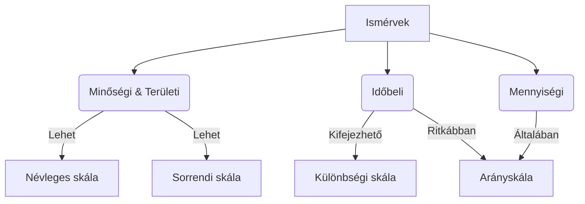

# A Statisztika Alapjai

A statisztikát sokan száraznak vagy ijesztőnek tartják, de valójában egy nélkülözhetetlen eszköz a minket körülvevő világ (legyen az gazdaság, társadalom vagy egy vállalat működése) megértéséhez. H.G. Wells szavaival élve: *"Egy napon a statisztikai gondolkodásmód a társadalom hasznos tagjává váló ember számára az íráshoz és olvasáshoz hasonló alapvető készséggé válik."*

> [!definition] [[Statisztika]]
> A statisztika a valóság tényeit tömören, számszerűen jellemezni, modellezni törekvő kettős tevékenység. Egyrészt **gyakorlati tevékenység** (adatgyűjtés, feldolgozás, elemzés), másrészt **tudományos módszertan** (az adatelemzés és következtetés elmélete).

---

## 1. Alapfogalmak és Ismérvek

Amikor statisztikát csinálunk, mindig egy megadott csoportot vizsgálunk valamilyen szempont alapján.

*   **Mit vizsgálunk?** $\rightarrow$ [[Sokaság]] (vagy populáció): A vizsgált egyedek összessége (pl. egy kórház összes betege).
*   **Mi alapján vizsgáljuk?** $\rightarrow$ [[Ismérv]]: A sokaság egységeinek valamilyen jellemzője (pl. életkor, nem, vércsoport).
*   **Ismérv-változatok:** Az ismérv lehetséges kimenetelei (pl. a "nem" ismérv esetén: férfi, nő).

> [!note] 💡 Érthető magyarázat (Közös és megkülönböztető ismérvek)
> Képzelj el egy egyetemi évfolyamot! A **közös ismérv** az, ami alapján mind egy csoportba tartoztok (pl. mindenki a Corvinus hallgatója). Ez definiálja a *sokaságot*. A **megkülönböztető ismérvek** azok, amiben eltértek (pl. életkor, hajszín, szak). A statisztika pont ezeket az *eltéréseket* (megkülönböztető ismérveket) vizsgálja!

### 1.1 Az ismérvek fajtái

Az ismérveket aszerint csoportosítjuk, hogy milyen jellegű információt hordoznak:

1.  **Minőségi (kvalitatív):** Verbális, szöveges jellemzés (pl. autómárka, családi állapot). Speciális esete az **alternatív ismérv**, aminek csak két kimenetele van (pl. sikeres/sikertelen vizsga).
2.  **Területi:** Térbeli elhelyezkedés (pl. lakóhely, cég székhelye).
3.  **Mennyiségi (kvantitatív):** Számszerű jellemzés. Ezt hívjuk **[[Változó]]**-nak (pl. magasság, fizetés).
4.  **Időbeli:** Időbeli elhelyezkedés (pl. születési év).

---

## 2. Mérési Skálák

Ahhoz, hogy az adatokkal (még a szövegesekkel is) számolni tudjunk, számokká kell kódolnunk őket. A mérési skála határozza meg, hogy ezekkel a számokkal *milyen matematikai műveleteket* végezhetünk el értelmesen.

> [!tip] Vizsgatipp
> A mérési skálák hierarchiát alkotnak. Ami igaz egy alacsonyabb szintű skálára (pl. Névleges), az igaz a felette lévőkre is, de fordítva nem! Mindig a lehető legmagasabb szintű skálát kell megállapítani egy adatnál.

| Skála típusa | Jellemző | Példa | Műveletek |
| :--- | :--- | :--- | :--- |
| **Névleges (Nominális)** | Csak azonosításra, címkézésre szolgál. | Neme (1=férfi, 0=nő), Rendszám. | Csak az egyenlőség/különbözőség (=, $\neq$) vizsgálható. |
| **Sorrendi (Ordinális)** | A sorrend is informális, de a távolság nem ismert. | Tanulmányi eredmény (1-5), Verseny helyezés. | Kisebb/nagyobb relációk is ($<, >$). |
| **Különbségi (Intervallum)** | A skálaértékek különbsége (távolsága) is értelmezhető. Nincs természetes nulla pont. | Hőmérséklet (Celsius), Évszámok. | Összeadás, kivonás (+, -). |
| **Arány (Ratio)** | Van természetes nulla pontja, így az arányuk (hányszorosa) is értelmes. | Fizetés, Súly, Alapterület. | Szorzás, osztás (*, /). |

### Ismérvfajták és Mérési skálák kapcsolata (Mermaid hierarchia)

---

## 3. Statisztikai Adatok és Hibák

Az adatok forrása szerint beszélhetünk **alapadatról** (mérés/számlálás útján szerzett) és **leszármaztatott számról** (számítás eredménye, pl. átlag, viszonyszám).

### Hibakorlátok képletei
Minden mérés tartalmazhat hibát. Jelöljük a tényleges adatot $A$-val.
*   **Abszolút hibakorlát ($a$):** A tévedés maximális mértéke azonos mértékegységben. Az adat valós értéke az $[A-a, A+a]$ intervallumban van.
*   **Relatív hibakorlát ($\alpha$):** A hiba aránya a mért adathoz képest, százalékban kifejezve.
    $$\alpha = \frac{a}{A}$$

---

## 4. Az egyszerű elemzések eszközei

### 4.1 Statisztikai sorok és táblák
A statisztikai sor az adatok meghatározott logikájú felsorolása.
1.  **Csoportosító sor:** A sokaság tagolása egy ismérv szerint (pl. népesség megyénként). Van "Összesen" sora.
2.  **Összehasonlító sor:** Különböző, de azonos fajtájú adatok összevetése. Nincs értelme összegezni (pl. Közép-európai országok népsűrűsége - hiába adod össze az országok népsűrűségét, nem kapsz értelmes adatot).
3.  **Leíró sor:** Egy jelenség különféle (más mértékegységű) adatai (pl. Magyarország területe, népessége, népsűrűsége egy sorban).

> [!definition] [[Kombinációs tábla]] (Kontingencia tábla)
> Olyan statisztikai tábla, amelynek a sorai és az oszlopai is csoportosító sorok. Legalább két dimenzió mentén tagolja a sokaságot (pl. Népesség korcsoportonként ÉS országonként).

### 4.2 Grafikus ábrázolás
A diagramválasztás mindig az ismérvek **számától** és **típusától** függ.

*   **Minőségi ismérvek (megoszlás, szerkezet):** Kördiagram, (halmozott) oszlopdiagram.
*   **Mennyiségi és Időbeli ismérvek (fejlődés, kapcsolat):** Vonaldiagram, pontdiagram (XY), területdiagram.
*   **Két ismérv (pl. minőségi + minőségi):** Perecdiagram, halmozott oszlopdiagram.

> [!tip] Vizsgatipp: Gyakori diagram-hibák
> *   **Kördiagram:** Csak egy időpont/egy szempont megoszlásának ábrázolására jó. Ha több évet hasonlítasz össze kördiagrammal (perecdiagram), az torzít és nehezen olvasható. Használj helyette *100%-ig halmozott oszlopdiagramot*!
> *   **Vonaldiagram egyenetlen tengellyel:** Idősoroknál, ha az X tengelyen lévő évek nem egyenlő távolságra vannak (pl. 1990, 2001, 2011, 2016), tilos sima vonaldiagramot használni, mert a vonal meredeksége hazudni fog. Helyette **XY (pont) diagramot** kell alkalmazni!

### 4.3 [[Viszonyszámok]]

A viszonyszám ($V$) két, egymással logikai kapcsolatban lévő adat hányadosa. 

$$V = \frac{A}{B}$$
*(A = viszonyítás tárgya; B = viszonyítás alapja / bázis)*

#### Viszonyszám típusok

1.  **Megoszlási viszonyszám:** A rész viszonya az egészhez. (Kizárólag *csoportosító sorból* számolható!). Mindig dimenzió nélküli (általában százalék).
    *   *Példa:* A lakosság hány százaléka házas? (Házasok / Összes lakos).
2.  **Összehasonlító viszonyszám:** Két azonos fajtájú adat hányadosa (nincs "egész", aminek a részei lennének).
    *   *Koordinációs:* Két egyenrangú rész összevetése. (pl. 100 nőtlenre hány házas jut? $\rightarrow$ Házas / Nőtlen).
    *   *Dinamikus:* Különböző időpontok adatainak aránya. (pl. 2022-es népesség / 1960-as népesség).
3.  **Intenzitási viszonyszám:** Két teljesen *különböző* (más mértékegységű) sokaság adatainak aránya. Ennek **mindig van mértékegysége**!
    *   *Példa:* Egyetemi hallgatók száma / Oktatók száma = Egy oktatóra jutó hallgatók száma (fő/fő, de logikailag "hallgató/oktató"). Népességsűrűség (fő/km²).

> [!note] 💡 Érthető magyarázat (Százalék vs. Százalékpont)
> Ez a statisztika egyik legfontosabb hétköznapi szabálya! 
> Ha egy iskolában a nők aránya 40%-ról 60%-ra nő:
> *   Különbség (kivonás): $60\% - 40\% = 20$. Ezt **százalékpontnak** hívjuk! (A nők aránya 20 százalékponttal nőtt).
> *   Arány (osztás): $60 / 40 = 1,5$. Ez **százalékos növekedés**! (A nők aránya másfélszeresére nőtt, azaz 50%-kal emelkedett).
> Ha a híradóban azt mondják, "a munkanélküliség 5%-ról 10%-ra, azaz 5 százalékkal nőtt", **statisztikai hibát vétenek**. Valójában 5 százalékponttal, vagy 100%-kal (a duplájára) nőtt!

---

## Ellenőrző kérdések (Aktív felidézés)

> [!faq]- Milyen mérési skálán mérjük a bankszámlánk egyenlegét és miért?
> **Arányskálán.** A pénzösszeg egy mennyiségi ismérv, aminek van természetes (objektív) nulla pontja (0 Ft = nincs pénz). Emiatt van értelme a szorzásnak és osztásnak (kétszer annyi pénzem van, mint neked).

> [!faq]- Mi a különbség a megoszlási és a koordinációs viszonyszám között?
> A **megoszlási** a *rész és az egész* aránya (pl. Corvinusosok száma / Összes magyar egyetemista). A **koordinációs** a *rész és egy másik rész* aránya (pl. Corvinusosok száma / BME-sek száma).

> [!faq]- Egy táblázat adatai: Magyarország népessége 9,5 millió fő, GDP-je X milliárd Ft. Milyen típusú statisztikai sor ez?
> Ez egy **leíró sor**, mert egyazon jelenségre (Magyarország) vonatkozó, de különböző fajtájú és eltérő mértékegységű (fő vs. Ft) ismérveket sorol fel.

> [!faq]- Ha az x-tengelyen az évek: 2000, 2010, 2020, 2021 szerepelnek, miért tilos hagyományos vonaldiagramot használni?
> Mert a vonaldiagram (a kategória-tengely miatt) az időpontokat vizuálisan egyenlő távolságra helyezné el egymástól, függetlenül attól, hogy 10 év vagy 1 év telt el közöttük. Ez torzítja a változás meredekségét. Ilyenkor XY (pont) diagramot kell használni.