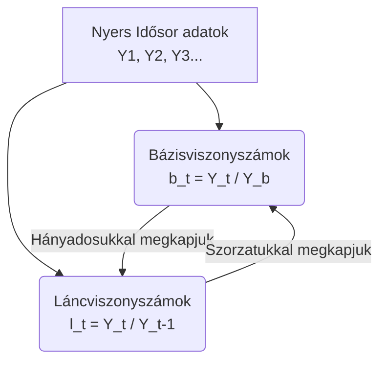

# Viszonyszámok haladó alkalmazása

A statisztikában gyakran nem elégszünk meg egyszerű arányok kiszámításával. Sokszor arra vagyunk kíváncsiak, hogyan változnak ezek az arányok az idő múlásával, vagy mi történik, ha több viszonyszámot kombinálunk. Ebben a jegyzetben a [[Viszonyszámok]] összetettebb alkalmazásait nézzük át.

## 1. Viszonyszámok viszonyítása

Amikor egy már kiszámított viszonyszámot (például egy arányt vagy egy átlagos mutatót) egy másik időpontbeli értékéhez viszonyítunk, akkor lényegében a **viszonyszám dinamikáját** (időbeli változását) vizsgáljuk.

> [!note] 💡 Érthető magyarázat
> Képzeld el, hogy kiszámoltad, egy egyetemi oktatóra hány hallgató jut (ez egy [[Intenzitási viszonyszám]]). Ha ezt az értéket kiszámolod a tavalyi és az idei évre is, majd megnézed, hogy a kettő hogyan aránylik egymáshoz, akkor a viszonyszám változását (dinamikáját) kaptad meg. Ezt hívjuk "viszonyszámok viszonyításának".

### Példák a gyakorlatból

**1. Intenzitási viszonyszám dinamikája:**
Tavaly 1 oktatóra 11,78 hallgató jutott ($V_0$). Idén 1 oktatóra 12,48 hallgató jut ($V_1$).
A változás (dinamika): 
$$ V^* = \frac{V_1}{V_0} = \frac{12,48}{11,78} \approx 1,06 $$
Tehát az egy oktatóra jutó hallgatók száma 6%-kal nőtt.

**2. Megoszlási viszonyszám dinamikája:**
1960-ban a lakosság 67,8%-a volt házas ($V_0$). 2025-ben ez 41,3% ($V_1$).
A változás:
$$ V^* = \frac{V_1}{V_0} = \frac{41,3\%}{67,8\%} \approx 0,61 $$
Tehát a házasok aránya a népességen belül 39%-kal (azaz a korábbi arány 61%-ára) csökkent.

> [!tip] Vizsgatipp
> Figyelj a **százalék** és a **százalékpont** különbségére! A fenti példában a házasok aránya *százalékosan* 39%-kal csökkent, de ha egyszerűen kivonjuk a két számot egymásból ($41,3 - 67,8 = -26,5$), akkor azt mondjuk, hogy **26,5 százalékponttal** csökkent!

## 2. Viszonyszámok egymásutánja (Láncolás)

Gyakran előfordul, hogy két különböző viszonyszámot (pl. egy megoszlást és egy dinamikát) egymásba kell ágyaznunk. 

> [!definition] Viszonyszámok egymásutánja
> Két viszonyszám ($V$ és $V^*$) egymásba ágyazásakor matematikai szempontból **a viszonyszámok sorrendjének nincs szerepe**.
> Képlettel kifejezve:
> $$ V^*(V) = V(V^*) $$

*Analógia:* Mindegy, hogy először megnézem az egy gondozónőre jutó gyerekek számát (intenzitás), és utána ennek a 10 éves változását (dinamika), VAGY külön-külön megnézem a gyerekek számának változását és a gondozónők számának változását, majd a két változás (dinamika) arányát veszem (intenzitás). Az eredmény ugyanaz lesz.

## 3. Dinamikus viszonyszámok (Idősorok elemzése)

Ha egy jelenséget időben vizsgálunk (pl. $Y_1, Y_2, ..., Y_t, ..., Y_n$ adatokat), akkor a változásokat kétféleképpen fejezhetjük ki. Ezek a [[Dinamikus viszonyszámok]].

### A két alapvető típus

| Típus | Definíció | Képlet | Mikor használjuk? |
| :--- | :--- | :--- | :--- |
| **[[Bázisviszonyszám]]** | Az adott időszaki adatot mindig egy **fix, kitüntetett (bázis) időszakhoz** viszonyítja. | $$ b_t = \frac{Y_t}{Y_b} $$ | Ha arra vagyunk kíváncsiak, honnan indultunk, pl. "Mennyit nőtt a GDP 2010-hez képest?" |
| **[[Láncviszonyszám]]** | Az adott időszaki adatot mindig az **azt közvetlenül megelőző** időszakhoz viszonyítja. | $$ l_t = \frac{Y_t}{Y_{t-1}} $$ | Ha az évről évre történő, aktuális növekedési ütem (trend) érdekel minket. |

### Összefüggések a bázis- és láncviszonyszámok között

A statisztikában ez a két mutató oda-vissza átszámítható egymásba. A megértéshez íme egy logikai ábra:

**1. Láncviszonyszám számítása bázisviszonyszámból:**
Két egymást követő bázisviszonyszám hányadosa megadja a láncviszonyszámot.
$$ l_t = \frac{b_t}{b_{t-1}} $$

**2. Bázisviszonyszám számítása láncviszonyszámból:**
A láncviszonyszámok szorzata megadja a bázisviszonyszámot.
$$ b_n = \prod_{i=2}^n l_i $$
*(Magyarázat: Ha tudom, hogy az 1. évről a 2. évre 10%-ot nőtt ($1,1$), a 2.-ról a 3.-ra meg 20%-ot ($1,2$), akkor az 1. évről a 3. évre a növekedés $1,1 \cdot 1,2 = 1,32$, azaz 32%-os bázisnövekedés).*

**3. Új bázisra térés:**
Ha a vizsgált időszak bázisát meg akarjuk változtatni (pl. 2006 helyett 2015-höz akarunk viszonyítani mindent), akkor a régi bázisviszonyszámot elosztjuk az új bázisév régi bázisviszonyszámával.
$$ b_t^{\text{új bázisú}} = \frac{b_t}{b_c} $$

---

## Ellenőrző kérdések

> [!faq]- Mi a különbség a bázisviszonyszám és a láncviszonyszám között?
> A **bázisviszonyszám** egy fix, állandó referencia-időponthoz (pl. a kezdőévhez) viszonyítja az adatokat. A **láncviszonyszám** viszont mindig a közvetlenül megelőző időszakhoz (pl. az előző évhez) viszonyít, így az évről évre történő változást mutatja.

> [!faq]- Ha ismerjük egy időszak láncviszonyszámait, hogyan kaphatjuk meg belőlük a bázisviszonyszámot?
> A láncviszonyszámok összeszorzásával. Képlettel: $b_n = \prod_{i=2}^n l_i$. (Pl. ha minden évben 10%-kal nő egy érték, akkor két év alatt az összesített bázisváltozás $1,1 \cdot 1,1 = 1,21$).

> [!faq]- Igaz-e az az állítás, hogy "Két viszonyszám egymásba ágyazásakor a számítás sorrendje befolyásolja a végeredményt"?
> **Nem igaz.** A viszonyszámok egymásutánjára érvényes a $V^*(V) = V(V^*)$ szabály. A sorrend felcserélhető (pl. egy intenzitási viszonyszám dinamikája egyenlő a dinamikus viszonyszámok intenzitásával).

> [!faq]- Ha az egyetemre jelentkezők aránya a közgazdász szakon 10,8%-ról 11,0%-ra nőtt, hogyan fejezzük ki a növekedést precízen?
> Kétféleképpen mondhatjuk: A jelentkezők aránya **0,2 százalékponttal** nőtt (11,0 - 10,8). Ha viszont magát az arányt osztjuk el egymással ($11,0 / 10,8 \approx 1,0185$), akkor mondhatjuk, hogy a jelentkezők aránya (viszonylagosan) kb. **1,85%-kal** emelkedett.