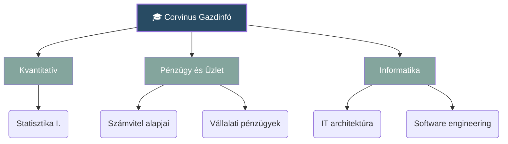

---
Kezdőlap
---

# 🎓 Corvinus Gazdinfó Tudásbázis

Üdv a személyes egyetemi jegyzet-széfedben! Ez a kezdőlap a központi irányítópultod a félévhez.

> [!quote] Napi fókusz
> "Egy jó kávé és egy strukturált jegyzet a sikeres vizsgaidőszak titka." ☕️

## 📚 Aktuális Félév Tantárgyai

Kattints a tantárgy nevére a hozzá tartozó jegyzetek és fogalmak eléréséhez:
* 📊 [[Statisztika I]
* 💾 [[IT architektúra]]
* 💻 [[Software engingeering]]
* 📈 [[Vállalati pénzügyek]]
* 💰 [[Számvitel alapjai]]

## 🗺️ Félév áttekintése

